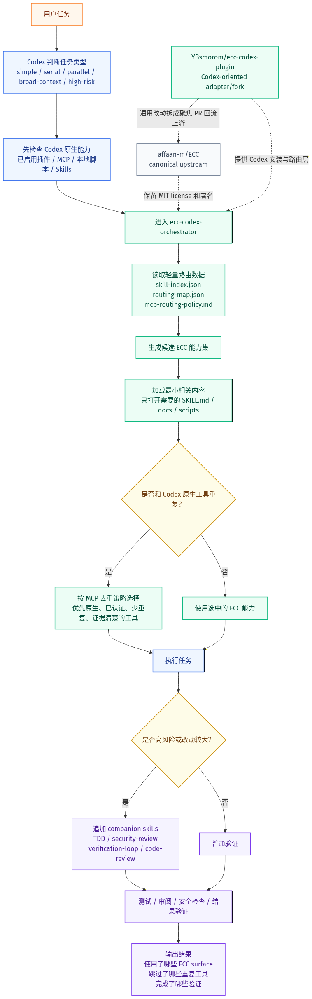

# ECC for Codex

[English](README.md) | [上游 ECC README](docs/upstream/README.zh-CN.affaan-m-ECC.md) | [Codex 适配说明](CODEX-ADAPTATION.zh-CN.md)


[affaan-m/ECC](https://github.com/affaan-m/ECC) 仍是 ECC 的 canonical upstream（规范上游）。这个仓库是面向 Codex 的 adapter/fork，服务于现在想通过仓库 URL 让 Codex 安装 ECC 的使用者。它保留原 ECC 内容，并补齐 Codex 插件元数据、路由技能、MCP 去重策略和安装说明，让 Codex 可以把 ECC 当作按任务懒加载的大型插件来使用。

ECC 本身是一套面向 agentic work 的 harness-native operator system，包含技能、规则、命令、MCP 配置、安全工作流、TDD 工作流、代码评审和验证模式。本适配版的重点是：让这些能力可以在 Codex 里使用，而不假设 Claude Code 的 slash command、hook 或 agent 名称一定存在。

## ECC for Codex 流程图

下面展示的是已经提交到仓库的静态渲染图，因此读者看到的是同一张图，不依赖各自 Markdown 渲染器的 Mermaid 版本。



[Mermaid 源文件](assets/diagrams/ecc-for-codex-flow.zh-CN.mmd) | [SVG 导出](assets/diagrams/ecc-for-codex-flow.zh-CN.svg) | [PNG 导出](assets/diagrams/ecc-for-codex-flow.zh-CN.png)

## 这是什么

这是给 Codex 使用者准备的实际打包层：

- 保留上游 ECC 署名和 MIT 协议；
- 让使用者可以把仓库 URL 交给 Codex 来安装插件；
- 通过一个 Codex 路由入口，按任务选择最小够用的 ECC 技能和工具集合；
- 把不被 Codex 当前支持的 `async` hook 声明移除，并尽量保留有界 hook 行为。

除非 `affaan-m/ECC` 合并或主动链接本仓库，否则不要把本仓库表述为 canonical ECC 包或上游 ECC 发布版。上游 ECC 仍然是源项目。本仓库聚焦 Codex 安装、路由、去重和运行时适配；它不声称实现 Claude Code 后台 async hook 的完全同等能力。

## 用 Codex 安装

把下面这段话直接发给 Codex。使用者不需要手动 clone 仓库：

```text
请从 https://github.com/YBsmorom/ecc-codex-plugin 安装这个 ECC Codex 插件适配版。
把仓库根目录作为插件根目录，校验 .codex-plugin/plugin.json，
注册并启用为本地/用户插件，然后告诉我如何使用 ecc-codex-orchestrator。
```

这就是目标用户流程：把仓库 URL 粘贴给 Codex，再让 Codex 完成安装、校验和启用。

对负责安装的 Codex agent 来说，预期安装契约是：

1. 把 `https://github.com/YBsmorom/ecc-codex-plugin` 克隆到本机插件工作区。
2. 把克隆出来的仓库根目录当作插件根目录。
3. 优先用本机 Codex 插件校验器校验 `.codex-plugin/plugin.json`。
4. 把该目录注册或启用为本地/用户 Codex 插件。
5. 确认插件暴露 `ecc-codex-orchestrator`，再给用户一个简短使用示例。

手动兜底方式：

```powershell
git clone https://github.com/YBsmorom/ecc-codex-plugin.git
# 然后让 Codex 把这个克隆目录注册为本地插件。
```

## 本适配版新增了什么

| 新增表面 | 为什么需要 | 相比上游 ECC 的变化 |
| --- | --- | --- |
| `.codex-plugin/plugin.json` | 让 Codex 能把仓库识别为插件。 | 上游 ECC 不是以这个 fork 的 Codex 仓库 URL 安装流为主。 |
| `skills/ecc-codex-orchestrator/` | 给 Codex 一个统一路由入口，而不是直接加载完整 ECC。 | 上游技能保持不动；这里增加 Codex 选择器。 |
| `skill-index.json` 和 `routing-map.json` | 让 233 个技能先通过轻量元数据被检索。 | 避免一开始把全部技能正文塞进上下文。 |
| `mcp-routing-policy.md` | 处理 ECC MCP 与 Codex 原生工具、官方插件的重复。 | 默认选择更原生、更少重复、证据更清楚的工具。 |
| `hooks/hooks.json` | 提供不含 `async` 声明的 Codex-safe hook 图。 | 保留 Claude 源 hook 图作参考，并把原 async 条目适配为有界 Codex hook。 |
| 中英文文档 | 说明安装方式、边界、署名、校验和路由策略。 | 增加 Codex 使用者需要的说明，不删除上游文档。 |

## 为什么要做这个 fork

ECC 很有用，但体量不小。如果直接整包塞给 Codex，会造成上下文噪音、工具重复和路由不稳定。本适配版把集成策略显式化：

1. Codex 先从 `ecc-codex-orchestrator` 进入。
2. 路由器先读小索引，再按需打开技能正文。
3. 当 ECC MCP 和 Codex 原生工具或官方插件重叠时，优先使用更原生、更少重复的工具。
4. 高风险任务可以自动搭配验证、安全评审或代码评审技能。
5. hook 使用 Codex 当前支持的生命周期，不再触发 unsupported async hook 警告。

## 上游回流路径

本仓库本地改动应集中在 Codex 仓库 URL 安装路径。通用价值的路由、MCP 重复选择、Codex-safe hook 改动，应拆成聚焦 PR 回到 [affaan-m/ECC](https://github.com/affaan-m/ECC)，而不是只留在 fork 里。

## 版本和兼容性

### v2.0.0-rc.1 Codex 适配版

| 表面 | 本 fork 当前状态 |
| --- | --- |
| Codex 插件 manifest | 已提供 |
| 技能路由器 | `ecc-codex-orchestrator` |
| MCP 配置 | 可选参考配置，并带重复工具选择策略 |
| Hooks | 28 个 Codex-safe matcher，不含 `async` 声明 |
| Claude Code 资产 | 作为上游/参考材料保留 |
| npm package identity | 保留上游包身份，但在本 fork 中标记为 private；Codex 使用者应通过仓库 URL 安装，而不是把本 fork 当成新的 npm 包 |

Codex 安装本适配版时使用 `https://github.com/YBsmorom/ecc-codex-plugin`。上游 Claude Code marketplace 安装使用短标识 `ecc@ecc`；如果已经通过 `/plugin install ecc@ecc` 安装上游 ECC，之后不要再运行 `--profile full` 完整安装器。

上游插件命令的规范命名空间是 `/ecc:plan`。在 Codex 里，优先用自然语言任务触发 `ecc-codex-orchestrator` 路由；command shim 只作为兼容参考，除非当前 harness 明确支持。

GitHub Copilot prompt 文件位于 `.github/prompts/`，`.vscode/settings.json` 中启用了 `chat.promptFiles`，供兼容的 VS Code 版本读取。

发布和 harness 参考：

- [Hermes setup](docs/HERMES-SETUP.md)
- [ECC 2.0.0-rc.1 release notes](docs/releases/2.0.0-rc.1/release-notes.md)

MCP 管理说明：Claude Code 运行时禁用 MCP 应使用 `/mcp`，Claude Code 会把这些选择保存在 `~/.claude.json`。`ECC_DISABLED_MCPS` 只是 ECC 安装/同步过滤器，不是 live Claude Code toggle。

## Codex 如何使用 ECC

Codex 不应该一次性加载完整 ECC 内容。路由器采用渐进披露：

1. 先把任务分类为 simple、serial、parallel、broad-context 或 high-risk。
2. 读取轻量的技能索引、路由表和 MCP 策略。
3. 为当前任务选择最小相关 ECC 能力集合。
4. 只加载匹配技能正文，以及必要的验证/安全伴随技能。
5. 当 ECC MCP 与 Codex 原生工具或官方插件重复时，优先使用更原生、更少重复的工具。
6. 只有在读过脚本并确认适合当前工作区后，才运行 ECC 的脚本或参考 hook。

这样 ECC 作为一个较大的 Codex 插件仍然可控：路由明确、上下文占用小、重复工具不会乱用。

## 开源协议和署名

原 ECC 项目由 Affaan Mustafa 以 MIT 协议开源。这个仓库保留了上游 `LICENSE` 文件，并在 [NOTICE.md](NOTICE.md) 中说明本适配版的来源和改动边界。

上游项目：

- 源码：https://github.com/affaan-m/ECC
- 官网：https://ecc.tools
- 原中文 README：[docs/upstream/README.zh-CN.affaan-m-ECC.md](docs/upstream/README.zh-CN.affaan-m-ECC.md)
- 已归档的上游 GitHub Actions 工作流：[docs/upstream/github-workflows/](docs/upstream/github-workflows/)

这个仓库是面向上游 ECC 的 Codex 适配和打包层；除非被上游合并或链接，否则不应被描述成 canonical ECC 包或上游 ECC 发布版。

## 校验

发布前应通过插件校验：

```powershell
python <codex-home>\skills\.system\plugin-creator\scripts\validate_plugin.py <repo-path>
```

公开推送前还应扫描真实凭据。安全测试夹具里可能包含模拟 token/API key 字符串；真实 `.env` 文件不能提交。

## 上游 Catalog 快照

这个 Codex 适配版继续保留上游 ECC catalog。安装后，你现在可以使用 60 个代理、233 个技能和 75 个命令。

该快照用于保留上游校验脚本对 root README 的计数约束；Codex 实际使用时仍通过 `ecc-codex-orchestrator` 按任务懒加载。
