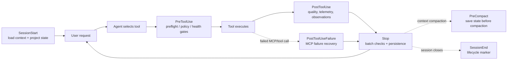

# Hooks

Hooks are event-driven automations that fire before or after agent tool executions. They enforce code quality, catch mistakes early, and automate repetitive checks.

## How Hooks Work

```
User request -> agent picks a tool -> PreToolUse hook runs -> Tool executes -> PostToolUse hook runs
```

- **PreToolUse** hooks run before the tool executes. They can **block** (exit code 2) or **warn** (stderr without blocking).
- **PostToolUse** hooks run after the tool completes. They can analyze output but cannot block.
- **Stop** hooks run after each agent response.
- **SessionStart/SessionEnd** hooks run at session lifecycle boundaries.
- **PreCompact** hooks run before context compaction, useful for saving state.

## Hooks in This Plugin

Memory persistence lifecycle definitions live in `hooks/memory-persistence/`.
The executable hook graph remains `hooks/hooks.json`; the memory persistence directory is the stable contract for SessionStart, PreCompact, observation, activity tracking, and SessionEnd behavior.

In this Codex-oriented adapter/fork, `hooks/hooks.json` is the Codex app compatible hook graph. It is generated from the preserved Claude Code source hook graph at `docs/upstream/claude-code-hooks.json` by converting unsupported async declarations into Codex-supported synchronous hook entries. Rebuild or check it with:

```bash
npm run codex:hooks:build
npm run codex:hooks:check
```

Codex app currently skips hooks that declare `async: true`, so the active Codex hook graph intentionally contains no `async` properties. Former async entries run through the Codex plugin bootstrap with Codex-aware root/data directory resolution, timeouts, and fail-open behavior where the underlying hook provides it.

## Codex Active Hook Flow

The active Codex hook graph is easiest to read as a lifecycle pipeline. `PreToolUse`
hooks can block the current tool call with exit code `2`. Later hooks should be
treated as observers, validators, or persistence jobs unless explicitly noted.



### Event Summary

| Event | When it fires | Can block? | Main purpose |
| --- | --- | --- | --- |
| `SessionStart` | When a session starts | No | Load bounded prior context and detect project/package-manager state. |
| `PreToolUse` | Before a tool call | Yes | Apply safety gates, health checks, reminders, and observation capture. |
| `PostToolUse` | After a successful tool call | No | Record results, run quality signals, update metrics, and warn. |
| `PostToolUseFailure` | After a failed tool call | Usually no; may steer future calls | Mark unhealthy MCP servers and attempt recovery. |
| `Stop` | After each assistant response | No in normal use | Batch checks, persistence, session evaluation, cost tracking. |
| `PreCompact` | Before context compaction | No | Save state before context is summarized or dropped. |
| `SessionEnd` | When the session ends | No | Write lifecycle marker and cleanup log. |

### Active Hook Inventory

This table is derived from `hooks/hooks.json`, the Codex-compatible active hook
graph. `Matcher` is the tool selector that causes the hook to run.

| Event | Hook ID | Matcher | Behavior |
| --- | --- | --- | --- |
| `SessionStart` | `session:start` | `*` | Loads previous context and detects package manager on a new session. |
| `PreToolUse` | `pre:bash:dispatcher` | `Bash` | Runs the consolidated Bash preflight bundle for quality, tmux/dev-server handling, push reminders, and GateGuard. |
| `PreToolUse` | `pre:write:doc-file-warning` | `Write` | Warns when writing non-standard documentation files; warning only. |
| `PreToolUse` | `pre:edit-write:suggest-compact` | `Edit\|Write` | Suggests manual compaction at logical tool-count intervals. |
| `PreToolUse` | `pre:observe:continuous-learning` | `*` | Captures tool intent for continuous-learning signals. |
| `PreToolUse` | `pre:governance-capture` | `Bash\|Write\|Edit\|MultiEdit` | Captures secrets, policy events, and approval-related signals when enabled with `ECC_GOVERNANCE_CAPTURE=1`. |
| `PreToolUse` | `pre:config-protection` | `Write\|Edit\|MultiEdit` | Blocks edits to linter/formatter configuration files so agents fix code instead of weakening config. |
| `PreToolUse` | `pre:mcp-health-check` | `*` | Checks MCP health before MCP tool execution and can block unhealthy MCP calls. |
| `PreToolUse` | `pre:edit-write:gateguard-fact-force` | `Edit\|Write\|MultiEdit` | Blocks the first edit/write to a file until the agent states the investigated facts and edit purpose. |
| `PostToolUse` | `post:bash:dispatcher` | `Bash` | Runs the consolidated Bash postflight bundle for command logging, PR URL detection, and build-completion notices. |
| `PostToolUse` | `post:quality-gate` | `Edit\|Write\|MultiEdit` | Runs fast quality checks after file edits. |
| `PostToolUse` | `post:edit:design-quality-check` | `Edit\|Write\|MultiEdit` | Warns when frontend edits drift toward generic template-looking UI. |
| `PostToolUse` | `post:edit:accumulator` | `Edit\|Write\|MultiEdit` | Records edited JS/TS files so `Stop` can run one batch format/typecheck pass. |
| `PostToolUse` | `post:edit:console-warn` | `Edit` | Warns when edited code introduces `console.log` statements. |
| `PostToolUse` | `post:governance-capture` | `Bash\|Write\|Edit\|MultiEdit` | Captures governance events from tool outputs when enabled with `ECC_GOVERNANCE_CAPTURE=1`. |
| `PostToolUse` | `post:session-activity-tracker` | `*` | Tracks per-session tool calls and file activity for ECC2 metrics. |
| `PostToolUse` | `post:observe:continuous-learning` | `*` | Captures tool results for continuous-learning signals. |
| `PostToolUse` | `post:ecc-metrics-bridge` | `*` | Maintains running session metrics for the statusline and context monitor. |
| `PostToolUse` | `post:ecc-context-monitor` | `*` | Injects warnings on context exhaustion, high cost, scope creep, or tool loops. |
| `PostToolUseFailure` | `post:mcp-health-check` | `*` | Tracks failed MCP calls, marks unhealthy servers, and attempts reconnect. |
| `Stop` | `stop:format-typecheck` | `*` | Runs one batch Biome/Prettier and `tsc` pass for edited JS/TS files. |
| `Stop` | `stop:check-console-log` | `*` | Checks modified files for `console.log` after each response. |
| `Stop` | `stop:session-end` | `*` | Persists session state after each response when transcript metadata is available. |
| `Stop` | `stop:evaluate-session` | `*` | Evaluates the session for extractable patterns. |
| `Stop` | `stop:cost-tracker` | `*` | Tracks token and cost metrics per session. |
| `Stop` | `stop:desktop-notify` | `*` | Sends a desktop notification on macOS/WSL in `standard` and `strict` profiles. |
| `PreCompact` | `pre:compact` | `*` | Saves state before context compaction. |
| `SessionEnd` | `session:end:marker` | `*` | Writes a non-blocking session-end lifecycle marker. |

### Bash Dispatcher Subhooks

`pre:bash:dispatcher` and `post:bash:dispatcher` are wrappers around smaller
subhooks in `scripts/hooks/bash-hook-dispatcher.js`.

| Dispatcher phase | Subhook ID | Default profile | Can block? | Purpose |
| --- | --- | --- | --- | --- |
| Pre Bash | `pre:bash:block-no-verify` | `minimal`, `standard`, `strict` | Yes | Blocks `--no-verify` and similar attempts to bypass quality gates. |
| Pre Bash | `pre:bash:auto-tmux-dev` | all profiles | Can steer/modify behavior | Routes long-running dev-server commands toward tmux-style operation where supported. |
| Pre Bash | `pre:bash:tmux-reminder` | `strict` | No | Reminds agents to use tmux for long-running commands. |
| Pre Bash | `pre:bash:git-push-reminder` | `strict` | No | Reminds agents to inspect work before pushing. |
| Pre Bash | `pre:bash:commit-quality` | `strict` | Yes for critical issues | Checks commit quality, staged-file issues, secrets, and obvious debug statements. |
| Pre Bash | `pre:bash:gateguard-fact-force` | `standard`, `strict` | Yes | Requires the agent to state the current request and what the Bash command verifies before the first Bash action. |
| Post Bash | `post:bash:command-log-audit` | all profiles | No | Logs command activity for audit/debugging. |
| Post Bash | `post:bash:command-log-cost` | all profiles | No | Adds lightweight command/cost telemetry. |
| Post Bash | `post:bash:pr-created` | `standard`, `strict` | No | Detects PR creation output and records the PR/review command. |
| Post Bash | `post:bash:build-complete` | `standard`, `strict` | No | Emits completion notices for build-like commands. |

### Operator Impact

Most hooks are fail-open observers. The hooks that operators most often notice
are the intentional blockers:

| Hook | Why operators notice it | Recovery |
| --- | --- | --- |
| `pre:bash:gateguard-fact-force` | Blocks the first Bash command until the agent states the request and command purpose. | Set `ECC_GATEGUARD=off` or add `pre:bash:gateguard-fact-force` to `ECC_DISABLED_HOOKS`. |
| `pre:edit-write:gateguard-fact-force` | Blocks first edits/writes until the agent states facts about the target file and intended change. | Set `ECC_GATEGUARD=off` or add `pre:edit-write:gateguard-fact-force` to `ECC_DISABLED_HOOKS`. |
| `pre:config-protection` | Blocks linter/formatter config edits. | Fix code instead, or explicitly disable the hook when intentionally changing quality policy. |
| `pre:mcp-health-check` | Blocks calls to MCP servers that are marked unhealthy. | Let the agent fall back to non-MCP tools or repair/restart the MCP server. |
| `stop:format-typecheck` | May add time after JS/TS edits. | Keep it enabled for code work; disable only for docs-only sessions if it becomes noisy. |

## Installing These Hooks Manually

For Claude Code manual installs, do not paste the raw repo `hooks.json` into `~/.claude/settings.json` or copy it directly into `~/.claude/hooks/hooks.json`. In this fork, the checked-in active file is Codex-oriented. Claude Code operators should use upstream ECC or the preserved source hook graph as reference material.

Use the installer instead so hook commands are rewritten against your actual Claude root:

```bash
bash ./install.sh --target claude --modules hooks-runtime
```

```powershell
pwsh -File .\install.ps1 --target claude --modules hooks-runtime
```

That installs resolved hooks to `~/.claude/hooks/hooks.json`. On Windows, the Claude config root is `%USERPROFILE%\\.claude`.

## Customizing Hooks

### Disabling a Hook

Remove or comment out the hook entry in `hooks.json`. If installed as a plugin, override in your `~/.claude/settings.json`:

```json
{
  "hooks": {
    "PreToolUse": [
      {
        "matcher": "Write",
        "hooks": [],
        "description": "Override: allow all .md file creation"
      }
    ]
  }
}
```

### Runtime Hook Controls (Recommended)

Use environment variables to control hook behavior without editing `hooks.json`:

```bash
# minimal | standard | strict (default: standard)
export ECC_HOOK_PROFILE=standard

# Disable specific hook IDs (comma-separated)
export ECC_DISABLED_HOOKS="pre:bash:tmux-reminder,post:edit:typecheck"

# Disable only GateGuard during setup or recovery
export ECC_GATEGUARD=off

# Cap SessionStart additional context (default: 8000 chars)
export ECC_SESSION_START_MAX_CHARS=4000

# Disable SessionStart additional context entirely
export ECC_SESSION_START_CONTEXT=off

# Keep context/scope/loop warnings but suppress API-rate cost estimates
export ECC_CONTEXT_MONITOR_COST_WARNINGS=off
```

Windows PowerShell:

```powershell
[Environment]::SetEnvironmentVariable('ECC_CONTEXT_MONITOR_COST_WARNINGS', 'off', 'User')
```

Profiles:
- `minimal` — keep essential lifecycle and safety hooks only.
- `standard` — default; balanced quality + safety checks.
- `strict` — enables additional reminders and stricter guardrails.

### Writing Your Own Hook

Hooks are shell commands that receive tool input as JSON on stdin and must output JSON on stdout.

**Basic structure:**

```javascript
// my-hook.js
let data = '';
process.stdin.on('data', chunk => data += chunk);
process.stdin.on('end', () => {
  const input = JSON.parse(data);

  // Access tool info
  const toolName = input.tool_name;        // "Edit", "Bash", "Write", etc.
  const toolInput = input.tool_input;      // Tool-specific parameters
  const toolOutput = input.tool_output;    // Only available in PostToolUse

  // Warn (non-blocking): write to stderr
  console.error('[Hook] Warning message shown to Claude');

  // Block (PreToolUse only): exit with code 2
  // process.exit(2);

  // Always output the original data to stdout
  console.log(data);
});
```

**Exit codes:**
- `0` — Success (continue execution)
- `2` — Block the tool call (PreToolUse only)
- Other non-zero — Error (logged but does not block)

### Hook Input Schema

```typescript
interface HookInput {
  tool_name: string;          // "Bash", "Edit", "Write", "Read", etc.
  tool_input: {
    command?: string;         // Bash: the command being run
    file_path?: string;       // Edit/Write/Read: target file
    old_string?: string;      // Edit: text being replaced
    new_string?: string;      // Edit: replacement text
    content?: string;         // Write: file content
  };
  tool_output?: {             // PostToolUse only
    output?: string;          // Command/tool output
  };
}
```

### Async Hooks

Claude Code supports hooks that should not block the main flow (e.g., background analysis):

```json
{
  "type": "command",
  "command": "node my-slow-hook.js",
  "async": true,
  "timeout": 30
}
```

Async hooks run in the background in Claude Code. They cannot block tool execution there. Codex app does not support async hooks yet; keep `async` properties out of the active `hooks/hooks.json` surface. For Codex, generate the active graph with `npm run codex:hooks:build` so former async capabilities are adapted into bounded synchronous hook entries instead of being declared as async.

## Common Hook Recipes

### Warn about TODO comments

```json
{
  "matcher": "Edit",
  "hooks": [{
    "type": "command",
    "command": "node -e \"let d='';process.stdin.on('data',c=>d+=c);process.stdin.on('end',()=>{const i=JSON.parse(d);const ns=i.tool_input?.new_string||'';if(/TODO|FIXME|HACK/.test(ns)){console.error('[Hook] New TODO/FIXME added - consider creating an issue')}console.log(d)})\""
  }],
  "description": "Warn when adding TODO/FIXME comments"
}
```

### Block large file creation

```json
{
  "matcher": "Write",
  "hooks": [{
    "type": "command",
    "command": "node -e \"let d='';process.stdin.on('data',c=>d+=c);process.stdin.on('end',()=>{const i=JSON.parse(d);const c=i.tool_input?.content||'';const lines=c.split('\\n').length;if(lines>800){console.error('[Hook] BLOCKED: File exceeds 800 lines ('+lines+' lines)');console.error('[Hook] Split into smaller, focused modules');process.exit(2)}console.log(d)})\""
  }],
  "description": "Block creation of files larger than 800 lines"
}
```

### Auto-format Python files with ruff

```json
{
  "matcher": "Edit",
  "hooks": [{
    "type": "command",
    "command": "node -e \"let d='';process.stdin.on('data',c=>d+=c);process.stdin.on('end',()=>{const i=JSON.parse(d);const p=i.tool_input?.file_path||'';if(/\\.py$/.test(p)){const{execFileSync}=require('child_process');try{execFileSync('ruff',['format',p],{stdio:'pipe'})}catch(e){}}console.log(d)})\""
  }],
  "description": "Auto-format Python files with ruff after edits"
}
```

### Require test files alongside new source files

```json
{
  "matcher": "Write",
  "hooks": [{
    "type": "command",
    "command": "node -e \"const fs=require('fs');let d='';process.stdin.on('data',c=>d+=c);process.stdin.on('end',()=>{const i=JSON.parse(d);const p=i.tool_input?.file_path||'';if(/src\\/.*\\.(ts|js)$/.test(p)&&!/\\.test\\.|\\.spec\\./.test(p)){const testPath=p.replace(/\\.(ts|js)$/,'.test.$1');if(!fs.existsSync(testPath)){console.error('[Hook] No test file found for: '+p);console.error('[Hook] Expected: '+testPath);console.error('[Hook] Consider writing tests first (/tdd)')}}console.log(d)})\""
  }],
  "description": "Remind to create tests when adding new source files"
}
```

## Cross-Platform Notes

Hook logic is implemented in Node.js scripts for cross-platform behavior on Windows, macOS, and Linux. The continuous-learning observer is exposed as a Node-mode hook and delegates to its existing `observe.sh` implementation through a profile-gated runner with Windows-safe fallback behavior.

## Related

- [rules/common/hooks.md](../rules/common/hooks.md) — Hook architecture guidelines
- [skills/strategic-compact/](../skills/strategic-compact/) — Strategic compaction skill
- [scripts/hooks/](../scripts/hooks/) — Hook script implementations
